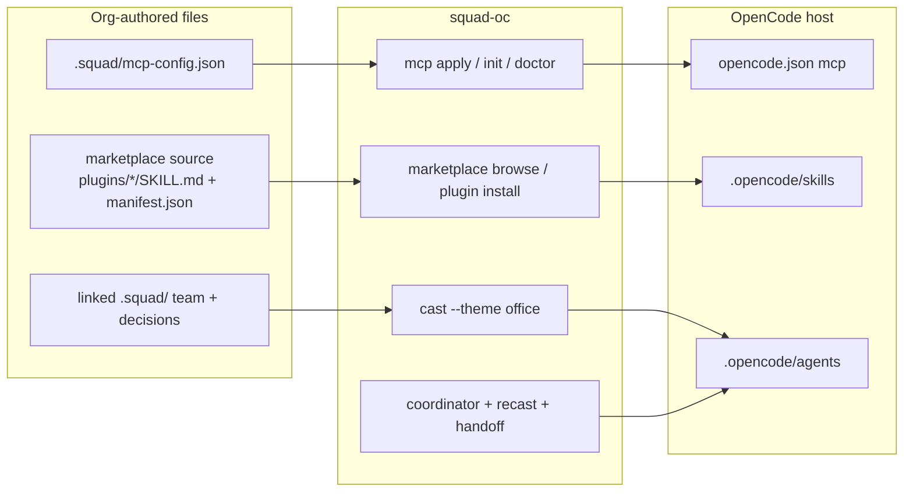

# Close the original-Squad DX gap (phased)

> **Pickup for next session.** Beads epic: `squad-o9r`. Implement Phase 0 first (workshop + use-case catalog, docs only). Then Phase 1 MCP. Do not start P2–P6 until P0/P1 land. Read this whole file before coding. Non-goals: Copilot, Ink, Aspire, `squad_state`.
>
> Sources: official site https://bradygaster.github.io/squad/ · Copilot blog · [Tamir workshop](https://github.com/tamirdresher/squad-skills/tree/main/workshop) · this repo’s `link` / `pack` / `upstream`.

## Goal

Give `squad-oc` the org DX people already like in original Squad, without Copilot:

| Pri | What | Why it felt easier on original |
|-----|------|--------------------------------|
| P1 | Org MCP via a committed `mcp-config.json` | Workshop recipe: drop config, agents talk to Teams/ADO/GitHub |
| P2 | Marketplace browse + install | Find a skill without memorizing a git URL |
| P3 | Themed cast (Office first) | Memorable names; later priority |
| P4 | Named plugins (`name@marketplace`) | `install reflect@acme` instead of a path |
| P5 | Coordinator vs specialist spawn/review | Thin router + independent review (author cannot fix rejected work) |
| P6 | Ceremonies | Design review / retro as files, not vibes |

Ship a **workshop** the team can run this week on what already exists, then grow a section per phase.

This is one implementation train. Each phase is its own later design/PR slice. Do not implement Copilot, Ink, Aspire, or a `squad_state` MCP server.

## Locked decisions

- **Hybrid, not a Copilot clone.** Keep `init` / `link` / `pack` / `upstream` / `watch`. Add discovery and OpenCode-native MCP on top.
- **Org shape:** shared team repo (`link`) + skills/MCP pack repo (`upstream` / marketplace). Service repos do not invent a team.
- **MCP file the org authors:** `.squad/mcp-config.json` (familiar from the Tamir workshop). **Runtime file OpenCode reads:** `opencode.json` `mcp` key. `squad-oc` is the translator.
- **Skills stay `SKILL.md`.** Install target is `.opencode/skills/<name>/`. Compatible with `tamirdresher/squad-skills` `plugins/<name>/` layout.
- **Default cast stays Lead / Frontend / Backend / Tester.** Office names are an opt-in theme (`--theme office`).
- **Human still merges.** Spawn/review is about independent agent context, not autopilot.
- **Docs first in Phase 0** so adoption is not blocked on P1–P6.

## Non-goals

- GitHub Copilot CLI, Copilot plugin marketplace CLI, `~/.copilot/mcp-config.json` as the live config
- Ink/`squad` shell, Aspire dashboard
- Implementing `squad_state` memory MCP (OpenCode + `.squad/` files remain memory)
- Porting WorkIQ / Outlook COM / Teams Adaptive Cards as product features (workshop may *mention* them as org MCP examples)

## Architecture



### MCP translation (P1)

Accept two input shapes so an org can paste a workshop-style block **or** write OpenCode-native:

```json
{
  "mcpServers": {
    "github": {
      "command": "npx",
      "args": ["-y", "@modelcontextprotocol/server-github"],
      "env": { "GITHUB_PERSONAL_ACCESS_TOKEN": "${GITHUB_TOKEN}" }
    }
  }
}
```

Write OpenCode:

```json
{
  "$schema": "https://opencode.ai/config.json",
  "mcp": {
    "github": {
      "type": "local",
      "command": ["npx", "-y", "@modelcontextprotocol/server-github"],
      "enabled": true,
      "environment": { "GITHUB_PERSONAL_ACCESS_TOKEN": "{env:GITHUB_TOKEN}" }
    }
  }
}
```

Rules:

- Merge into existing `opencode.json`; never wipe `$schema`, providers, or unrelated keys.
- `${VAR}` and `{env:VAR}` both mean “read the environment”; never write secret values into git.
- `enabled: false` in the org file disables that server in `opencode.json`.
- Remote servers (`url` + `headers`) map to OpenCode `type: "remote"`.
- Apply sources, in order: `.squad/mcp-config.json` (after `link` resolution), then optional pack file `mcp-config.json` at pack root. Project file wins on key conflict.
- `upstream sync` may copy a missing `.squad/mcp-config.json` from the pack (same “do not overwrite team memory” rule as today). It does **not** overwrite an existing org MCP file.

### Marketplace (P2) then named plugins (P4)

P2 adds a catalog on top of `pack` / `upstream`. P4 adds the `name@source` identity original Copilot users expect.

A marketplace source is a git URL or directory that contains either:

- `plugins/<name>/SKILL.md` (+ optional `manifest.json`, `scripts/`), or
- `marketplace.json` listing entries.

`squad-oc marketplace add acme https://github.com/acme/squad-skills.git` records the source (can live next to `upstreams.json`, e.g. `.squad/marketplaces.json`).

`browse` prints name, description, triggers. `install reflect` copies `plugins/reflect/` → `.opencode/skills/reflect/`.

P4: `install reflect@acme`, `plugin list`, version from `manifest.json`. Same copy path.

### Themed cast (P3)

`--theme office` (and later other themes) only changes **display names** in `team.md` and generated charters. Agent IDs stay stable (`lead`, `frontend`, …) so `@lead` and recast keep working. Suggested Office map:

| Role | Office name |
|------|-------------|
| Lead | Michael |
| Frontend | Jim |
| Backend | Dwight |
| Tester | Pam |
| Coordinator stays | Squad (not a character) |

Optional extra seats later: Creed (Scribe-like notes), Toby (HR/process) — not in the first theme pack.

### Spawn / review (P5)

Protocol in templates + handoff skill, enforced in docs and coordinator text (OpenCode has no hard file-write lockout like original SDK):

1. Coordinator does not implement multi-layer work itself.
2. Specialists spawn as separate OpenCode subagents (`task` / `@backend`).
3. Tester or Lead **rejects** with a written handoff; the **author agent must not** apply the fix. Coordinator assigns a different specialist or asks the human.
4. `decisions.md` records the review outcome when it is a durable rule.

### Ceremonies (P6)

Add `.squad/ceremonies.md` at init (missing-only, like other team files). Coordinator loads it. First two ceremonies only:

- **Design review** before a multi-agent feature
- **Retro** after a failed run or rejected PR

No scheduler in v1. Human or coordinator triggers in chat.

---

## Phase 0 — Workshop + use-case catalog (docs only)

**Why first:** the team can adopt `init` / `link` / `upstream` / `watch` this week. Later phases append sections; they do not rewrite the happy path.

### Deliverables

- `docs/workshop/README.md` — 90-minute adopt path, modeled on [Tamir’s workshop](https://github.com/tamirdresher/squad-skills/tree/main/workshop) but **squad-oc + OpenCode only**.
- `docs/use-cases.md` — workshop sections mapped to `squad-oc` (supported / later / won’t port).
- Link both from `docs/get-started.md` and README “Also useful”.

### Workshop outline (ease of use)

1. **Tools** — OpenCode, `squad-oc` on PATH, git, a model via `/connect`. No Copilot, no npm Squad CLI.
2. **Solo repo (15 min)** — `init --preset default` → `doctor` → `opencode` → Tab → `squad` → describe project → **yes**.
3. **Talk to the team** — `Team, add a usage endpoint…` and `@backend` / `@frontend` / `@tester`.
4. **Memory** — “Always require auth on usage” → show it in `.squad/decisions.md` → restart session → coordinator still knows.
5. **Org shape (the DX that beats original for multi-repo)**
   - Platform owner: `squad-oc init` in `acme/squad-platform`, edit `decisions.md`.
   - Pack owner: `.opencode/skills/…` in `acme/squad-skills`.
   - Service: `init` → `link ../squad-platform` → `upstream add org <url>` → `sync` → `doctor`.
6. **Ralph** — `squad-oc watch --execute --once` on a labeled issue.
7. **What’s next (stubs until phases land)** — MCP, marketplace browse, Office cast, named plugins, review lockout, ceremonies.

Each section has a **Try it** box and a **Success looks like** checklist (same style as `docs/get-started.md`).

### Example (Phase 0 org)

```bash
# platform
cd ~/teams/platform && squad-oc init --preset default --description "Acme platform"
# billing
cd ~/code/billing
squad-oc init --preset default
squad-oc link ~/teams/platform
squad-oc upstream add org git@github.com:acme/squad-skills.git
squad-oc upstream sync org
squad-oc doctor
opencode   # Tab → squad → "Set up the team" → yes
```

### Verification

- A teammate who has never used original Squad can finish sections 1–6 without Copilot.
- Every command in the workshop exists today (`go test ./...` already green; no new code required).
- “Won’t port” list matches README non-goals.

---

## Phase 1 — P1 Org MCP (`mcp-config.json`)

### Code

- New package `internal/mcpconfig` (parse, translate, merge). Keep `internal/cli` thin.
- CLI:
  - `squad-oc mcp apply` — merge `.squad/mcp-config.json` → `opencode.json`
  - `squad-oc mcp list` — show source vs applied servers (enabled/disabled, not secret values)
  - `squad-oc mcp init` — write a commented example `.squad/mcp-config.json` if missing
- `init` does **not** force MCP. `doctor` adds a **soft** check: if `.squad/mcp-config.json` exists, `opencode.json` must contain those server names.
- `link`: MCP file is read from the **linked** team dir (same as `team.md`).
- `upstream sync` / `pack`: copy `mcp-config.json` into `.squad/` only when absent.
- Example fixture: `internal/mcpconfig/testdata/org-mcp.json` + expected `opencode.json` snippet.

### Ease of use

One org file, one command, then OpenCode just works:

```bash
# in acme/squad-platform or the service repo
squad-oc mcp init
# edit .squad/mcp-config.json — GitHub + a local fake server for the workshop
export GITHUB_TOKEN=…   # never commit
squad-oc mcp apply
squad-oc mcp list
squad-oc doctor
# In OpenCode: "List the MCP tools you have"
```

Workshop addition: **Section 8 — Org MCP**. Use a **local, secret-free** example (e.g. a tiny `npx` server or a disabled remote stub) so CI and the workshop do not need real Teams/ADO.

### Verification

- Unit tests: Copilot-shaped `mcpServers` → OpenCode `mcp`; already-OpenCode input is pass-through; merge does not drop `$schema`; `${FOO}` → `{env:FOO}`; hardcoded `sk-` / `ghp_` values fail apply with a clear error.
- Conflict: existing `opencode.json` mcp server with same name — project/org file wins, test asserts the merge.
- Linked team: MCP file in the link target is what `apply` reads.
- `go test ./...`
- `doctor` soft-fail when config exists but apply was never run.
- Manual: after apply, OpenCode session can see the configured server (or document “reload OpenCode” if the host caches config).

### Out of scope here

Starting MCP processes ourselves. We only write config.

---

## Phase 2 — P2 Marketplace browse + install

### Code

- Extend `internal/share` (do not invent a second copy engine). Reuse `ApplySource` / skill copy.
- `.squad/marketplaces.json` — `{ "name", "path" }` like upstreams.
- CLI:
  - `squad-oc marketplace add <name> <path|git-url>`
  - `marketplace list` / `remove <name>`
  - `marketplace browse [name]` — table: plugin, description, triggers
  - `marketplace install <plugin> [--from <name>]` — copy into `.opencode/skills/<plugin>/`
- Discover plugins: `plugins/*/` with `SKILL.md`, or `marketplace.json`.
- `doctor` soft: listed marketplaces that fail to resolve.

### Example

```bash
squad-oc marketplace add community https://github.com/tamirdresher/squad-skills.git
squad-oc marketplace browse
# name                         source      triggers
# reflect                      community   retrospective, lessons learned
# fact-checking                community   verify, validate claims

squad-oc marketplace install reflect --from community
# → .opencode/skills/reflect/SKILL.md
```

If only one marketplace is registered, `--from` is optional.

### Workshop

**Section 9 — Skills marketplace.** Browse community (or a tiny fixture pack in `docs/workshop/fixtures/skills-pack/`) and install `reflect`. Ask squad: “Use the reflect skill on the last change.”

### Verification

- Tests with a local fixture pack (no network): browse returns two plugins; install copies SKILL.md; second install is idempotent; unknown name errors; git URL uses existing `CloneGit` hook.
- Installing does **not** overwrite `team.md` / `decisions.md`.
- `go test ./...`
- Workshop Try-it works offline via the fixture pack.

---

## Phase 3 — P3 Themed cast (Office)

### Code

- Theme table in `internal/squad/themes.go` (`office` only in v1).
- `squad-oc cast --theme office` rewrites **names** in `team.md` + charter titles, then `recast`.
- `cast --theme none` restores role names (Lead/Frontend/…) by **id**, not by current display name.
- IDs unchanged: `.opencode/agents/lead.md` still `@lead`.
- Coordinator template: if theme is set in `.squad/config.json`, propose themed names at first yes.

### Example

```bash
squad-oc cast --theme office
squad-oc status
# Michael  Lead
# Jim      Frontend
# Dwight   Backend
# Pam      Tester

# Chat still works either way:
# @lead  or  "Michael, review the API"
```

### Workshop

**Section 3b (optional)** — “Hire the Office.” Screenshot/table of the mapping. Stress that `@lead` still works so docs stay stable.

### Verification

- Theme apply + restore is invertible (test on a temp `team.md`).
- Recast writes the same agent IDs as before.
- Unknown `--theme` exits 2.
- `go test ./...`

---

## Phase 4 — P4 Named plugins

### Code

- `squad-oc plugin install <name>@<marketplace>`
- `plugin list` — installed skills with source + version (from `manifest.json` or `unknown`)
- `plugin uninstall <name>` — removes `.opencode/skills/<name>/` only (never `.squad/` memory)
- `marketplace install` becomes an alias of `plugin install` when a marketplace is implied
- Record install metadata in `.squad/plugins.json` (name, source, version, installedAt)

### Example

```bash
squad-oc plugin install reflect@community
squad-oc plugin list
squad-oc plugin uninstall reflect
```

### Workshop

Update Section 9 to prefer `plugin install reflect@community`. Keep path-based install as the fallback.

### Verification

- `name@source` resolves; missing marketplace / missing plugin errors are distinct.
- Uninstall does not delete charters or decisions.
- Reinstall after uninstall works.
- `go test ./...`

---

## Phase 5 — P5 Coordinator spawn + independent review

### Code / templates (no new Copilot runtime)

- Tighten `internal/squad/templates/opencode/agents/squad.md`: coordinator must spawn specialists for multi-layer work; must not patch rejected specialist output.
- Tighten `tester.md` + `lead.md`: reject in a handoff file; name the **next** agent (not the author).
- Extend `squad-handoff` skill with a **Review** block: `Verdict`, `Author`, `Fix owner` (must differ from Author), `Reasons`.
- Optional `.opencode/commands/squad-review.md` — “run independent review of the last specialist change.”
- `docs/workshop` Section 4: demo Tester rejecting Backend; Lead or Frontend applies the fix.

### Example (chat)

```text
Team, add GET /api/usage with tests.

# Tester writes .squad/comms/2026-08-14-tester-to-lead.md
# Verdict: reject — no auth check
# Author: backend
# Fix owner: lead

# Coordinator assigns @lead, not @backend
```

### Verification

- Template/unit tests that rendered agent files contain the lockout sentences (string fixtures).
- Workshop success check: a reviewer can point at the handoff file and see author ≠ fix owner.
- No claim of kernel-level enforcement — document “protocol + files,” same honesty as original’s reviewer protocol vs our host.

---

## Phase 6 — P6 Ceremonies

### Code / templates

- Add `internal/squad/templates/squad/ceremonies.md` (Design Review, Retro only).
- `init` writes it if missing. `upgrade` does not overwrite a customized copy.
- Coordinator + `squad-team` skill: before multi-agent features, run Design Review (short questions, write `.squad/comms/…-design-review.md`); after a failed watch/run, offer Retro.
- `docs/workshop` Section 11: trigger a design review in chat.

### Verification

- Fresh `init` contains `ceremonies.md`; second `init` / `upgrade` leaves edits intact.
- `go test ./...` (init/upgrade tests already cover “do not overwrite team memory” — extend them).

---

## Cross-cutting

### Doctor / help / README

Each phase that adds a command updates `printHelp`, README command table, `docs/get-started.md`, and workshop TOC. `doctor` only grows **soft** checks unless a file the user added is inconsistent (MCP apply drift).

### Tests and gates (every phase)

```bash
go test ./...
go build -o squad-oc.exe ./cmd/squad-oc
```

No live OpenCode in CI. Workshop “live” steps stay optional, like today’s `scripts/live-e2e.ps1`.

### Beads

When implementation starts, create one bead per phase (`squad-oc-roadmap-p0` … `p6`) with `discovered-from` links. Do not use markdown TODOs for tracking. Conservative git: do not commit or push unless asked.

### Suggested PR slices

1. Phase 0 docs
2. Phase 1 MCP
3. Phase 2 marketplace
4. Phase 3 theme
5. Phase 4 named plugins
6. Phase 5 review protocol
7. Phase 6 ceremonies

Do not combine P1+P2 in one PR. Marketplace must not block MCP.

## Risks

- **OpenCode MCP schema drift** — pin translation to `type` / `command` / `environment` / `url` / `headers` / `enabled` as documented; tests use fixtures so a host change is obvious.
- **Secret leakage** — apply refuses values that look like tokens; workshop only uses `{env:…}`.
- **`link` + MCP** — document that org MCP lives with the shared team; a service that needs an extra server adds keys locally and re-applies.
- **Review lockout is social, not mechanical** — say so in the workshop so we do not over-claim vs original SDK guards.
- **Themed names vs `@id`** — keep IDs stable or every skill and doc breaks.

## Done when

- A new teammate can run the workshop through org `link` + `upstream` (Phase 0) and, after P1–P2, add MCP + install a named skill without reading original Squad docs.
- `go test ./...` passes after each phase.
- Original-Squad DX table in the workshop shows each row as **squad-oc command** or **won’t port**.
